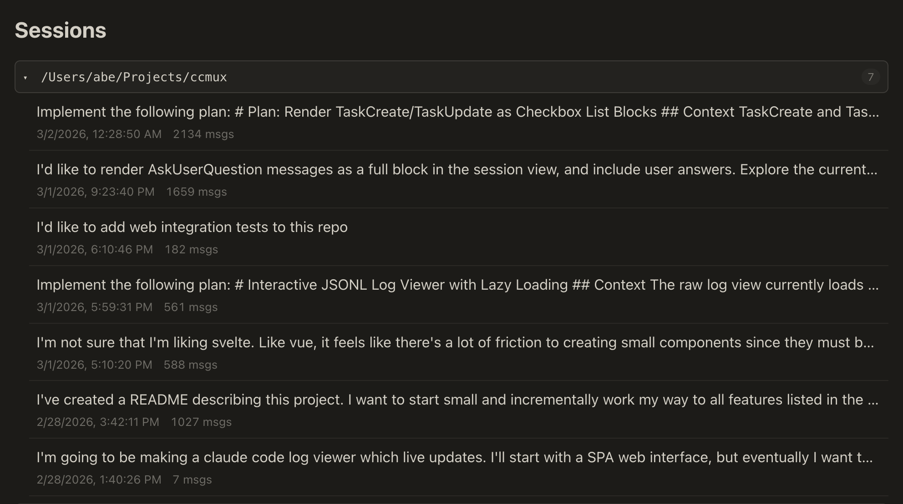
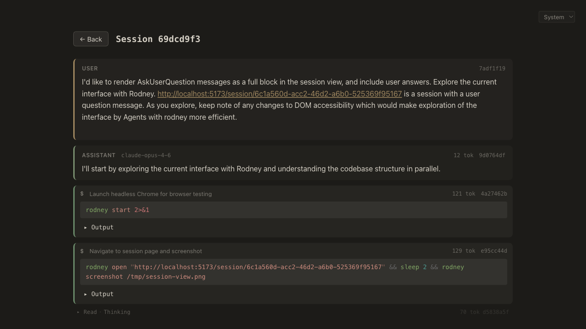
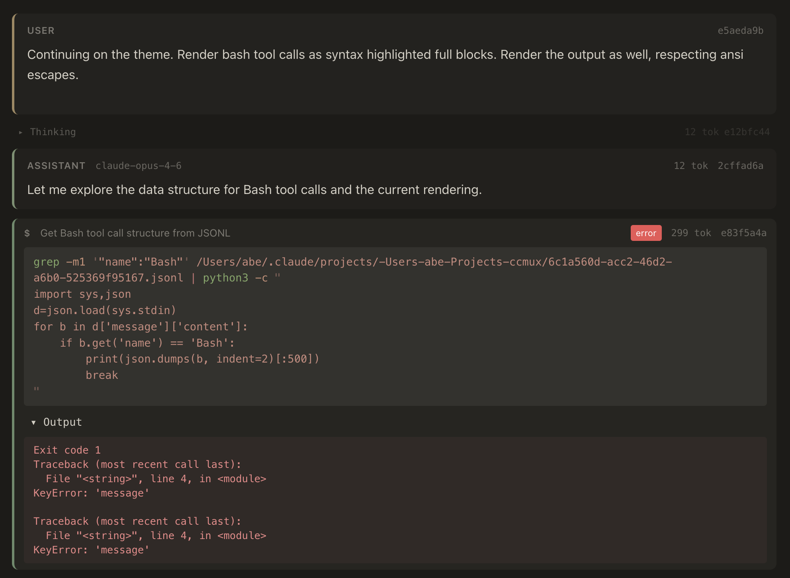
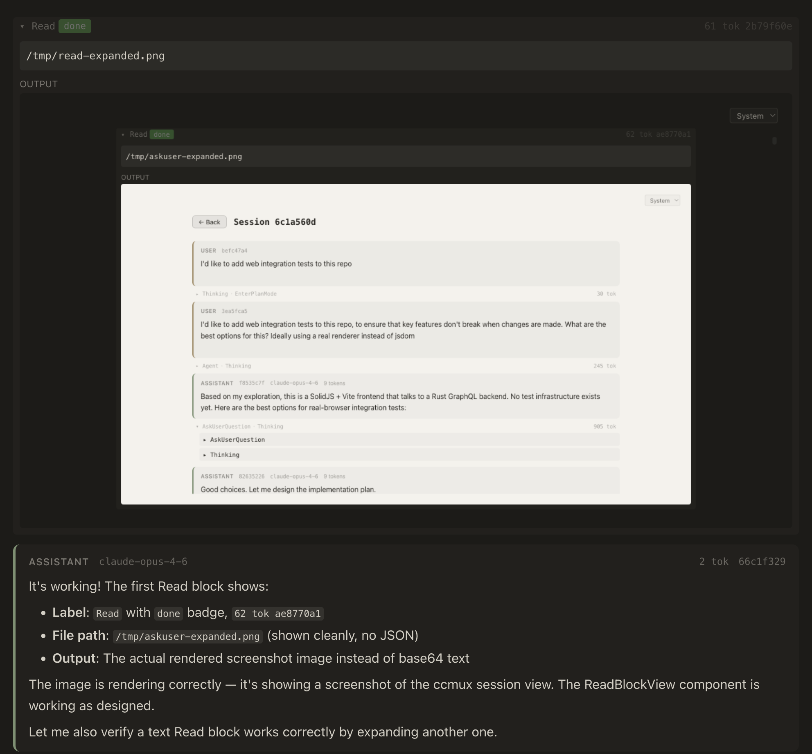
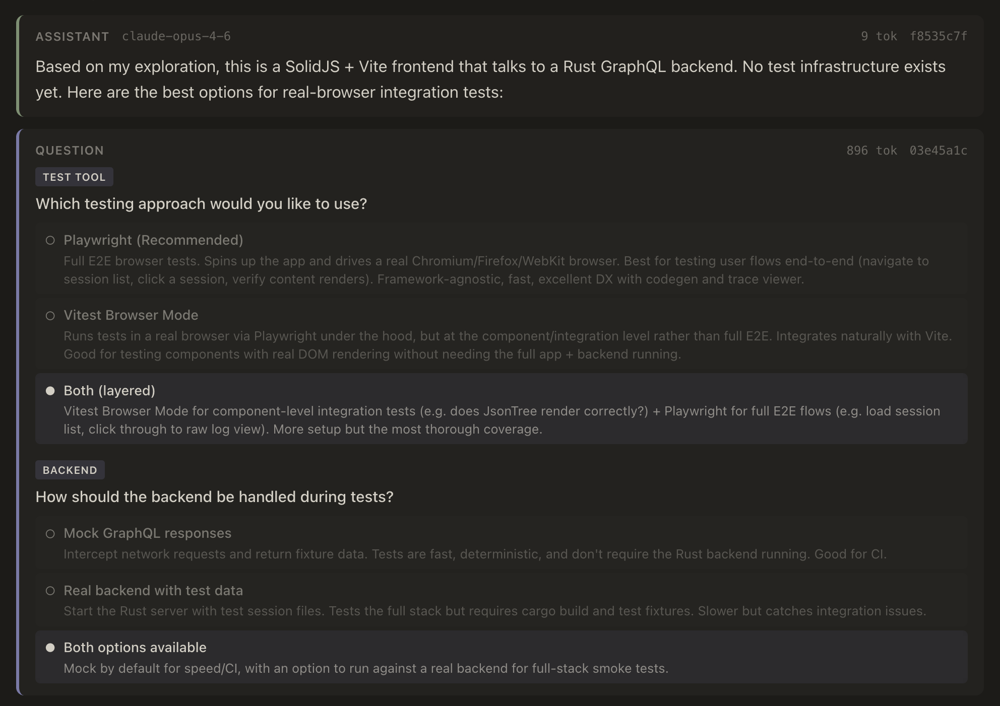
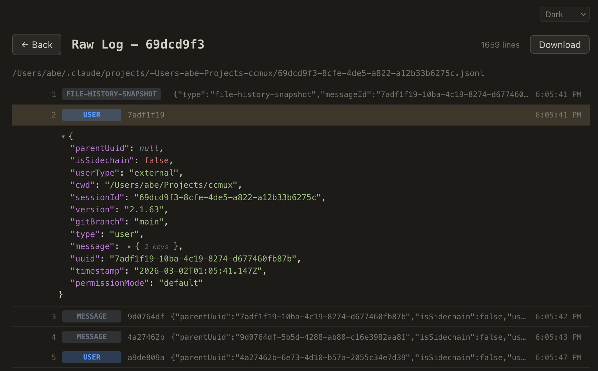

# unnamed claude code log utility

A session inspector and explorer for [Claude Code](https://docs.anthropic.com/en/docs/claude-code). Browse your session logs with a structured, interactive web UI that makes it easy to understand what happened during a coding session.

## Features

- **Session browser** — sessions grouped by project, sorted by recency, with message counts
- **Structured message rendering** — user messages, assistant responses, questions, plans, and system events each get their own visual treatment
- **Syntax-highlighted bash** — shell commands rendered with full syntax highlighting, collapsible output, and error badges
- **Image preview** — Read tool calls that return screenshots or images render inline instead of showing raw base64
- **Collapsible tool calls** — thinking traces, file reads, edits, searches, and other tool calls collapse into compact summaries with token counts
- **Subagent navigation** — agent tool calls link to their subagent sessions; subagent views show prompt and output summaries
- **Token usage** — every message and tool call shows its token cost
- **Raw log access** — every block links to its raw JSONL entry for debugging

## Screenshots

### Session List


### Session View


### Bash Tool Blocks


### Read Tool Image Preview


### Question Block


### Raw Log Viewer


## Architecture

### Server

Rust application serving a GraphQL API and the SPA web interface. Watches `.jsonl` log files for changes and updates the API accordingly.

### Web Client

Single Page Application built with TypeScript and SolidJS. Uses Shiki for bash syntax highlighting. Built with Vite; uses Bun for development.

### Nix

A nix flake provides a dev shell and build outputs for both the server and web client.

## Development

```
cargo run          # backend on :3001
cd web && bun dev  # frontend on :5173
```

## Future

- Export sessions as markdown with configurable detail level
- Edit tool calls rendered as diffs
- Session search and filtering
- Remote session control with terminal access
- Voice interface
- iOS client
